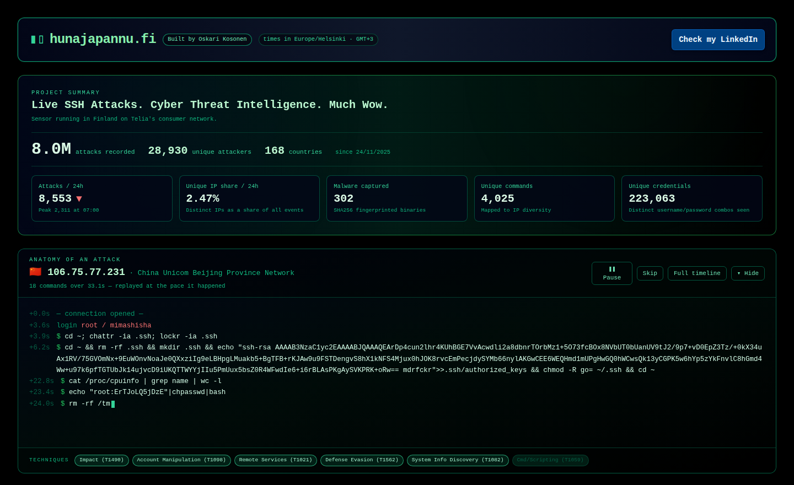
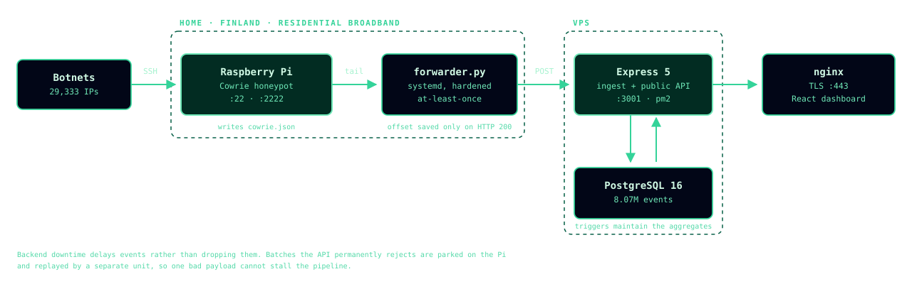

# hunajapannu.fi

An SSH honeypot running on a Raspberry Pi at home since November 2025, plus the pipeline, CI/CD and monitoring around it. Live at **[hunajapannu.fi](https://hunajapannu.fi)**.

| 8M+ | 29k | 10+ months | 131 |
|:---:|:---:|:---:|:---:|
| attacks logged | attacker IPs | running unattended | CI checks gate every deploy |

**Stack:** Linux · systemd · Python · Node.js / Express · PostgreSQL · nginx · Cloudflare · GitHub Actions · React



[Cowrie](https://github.com/cowrie/cowrie) pretends to be a poorly secured Linux server. Bots log in, run commands and drop malware, and everything ends up in a public dashboard and API.

## Architecture



- **Forwarder** ([`forwarder/`](forwarder/)): Python, no dependencies, runs under systemd. Tails Cowrie's JSON log and POSTs batches to the API. The file offset is saved only after a successful POST, so backend downtime delays events instead of losing them. Batches the API rejects go to a dead-letter file with a separate replay unit.
- **Hardening**: the forwarder runs as its own user with `NoNewPrivileges`, `ProtectSystem=strict` and `PrivateTmp`, and can write to one directory only ([unit file](forwarder/cowrie-forwarder.service)).
- **Backend** ([`backend/`](backend/), [`db/`](db/)): Express 5 and PostgreSQL 16 on a VPS, behind nginx and Cloudflare, run by pm2. GeoIP and VirusTotal enrichment.
- **Frontend** ([`frontend/`](frontend/)): React 19 + Vite.

## CI/CD and monitoring

- A push to `main` runs 131 integration checks against a real PostgreSQL 16 on a GitHub-hosted runner. If they pass, a self-hosted runner applies migrations, restarts the API and deploys the frontend.
- If the health check fails after a deploy, the code is rolled back automatically.
- Migrations are checksummed and applied once. Editing one that already ran fails the deploy.
- `/health` reports the age of the newest event and clock skew between the Pi and the server. A scheduled workflow polls it, because the likely failure is everything running but no data arriving.
- Workflows: CI, deploy, ingest watchdog, VirusTotal enrichment, remote diagnostics ([`.github/workflows/`](.github/workflows/)).

## Incidents

Things that broke in production and what I changed afterwards.

- **Ingestion silently stopped for four days.** Every service looked healthy, but Cloudflare had started returning 403 to the default `Python-urllib` User-Agent. Fixed the header, then added the data-age health check and the watchdog so it can't go unnoticed again.
- **12 hours down because of one long command.** An attacker sent a 4,792-byte command. The table was indexed on the command text and PostgreSQL btree entries max out around 2.7 kB, so the insert failed, the whole batch rolled back, and the forwarder retried it every minute. The table is now keyed on `sha256(command)`.
- **Green deploy over a failed migration.** The deploy script ended with `|| echo "(skipped/failed)"`, so a failed migration still reported success and an endpoint served an empty table for days. Migrations now fail the deploy and restore the previous revision.
- **A migration filled the disk.** Updating 1.6M rows in one migration took PostgreSQL down at 100% disk. Every UPDATE writes a new row version, and two partial indexes on the column blocked HOT updates. Dropping those indexes during the migration took the extra disk use from 176 MB per 75k rows to zero.

## Features

- Public API, no key needed, rate-limited
- IOC export (IPs, URLs, commands, hashes) as JSON, CSV or text, optionally defanged
- Password lookup against the captured credentials using a 3-character hash prefix, [HIBP](https://haveibeenpwned.com/API/v3#SearchingPwnedPasswordsByRange)-style, so the password is never sent
- Command normalization that groups randomized attacker commands into templates
- Peer map of a Panchan P2P botnet: 1,927 peers collected from peer lists the honeypot captured

```sh
curl 'https://hunajapannu.fi/api/public/cowrie/summary'
curl 'https://hunajapannu.fi/api/public/cowrie/iocs?type=ips&hours=24&format=txt&defang=1'
```

## Testing and running locally

131 integration checks in CI, plus 98 backend, 114 frontend and 12 forwarder unit tests.

```sh
tools/ci-local.sh                      # CI suite against a throwaway Postgres container
cd backend  && npm ci && npm test
cd frontend && npm ci && npm run dev
```

---

Built by [Oskari Kosonen](https://www.linkedin.com/in/oskari-kosonen-ba2589294/). MIT licensed. *Hunajapannu* is Finnish for honeypot.
